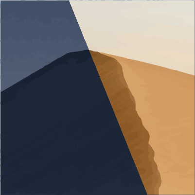
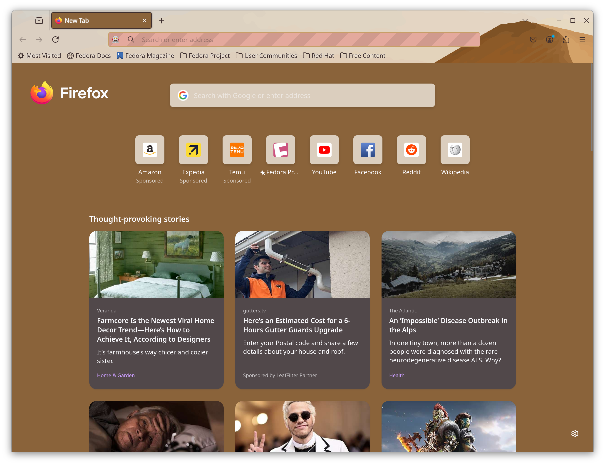
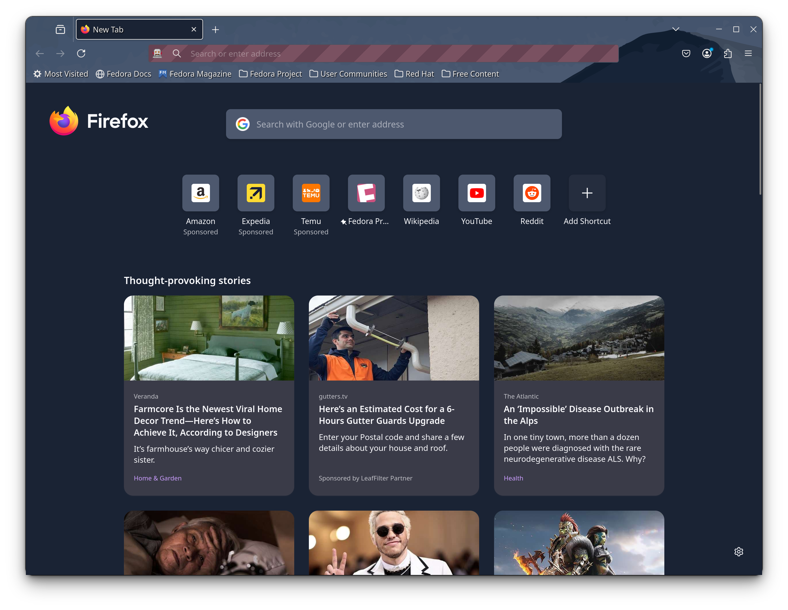

# Mojave Dynamic Theme Extension

 

A simple MacOS inspired Mojave Dynamic Theme.

[**Theme Download**](https://addons.mozilla.org/en-CA/firefox/addon/macos-mojave-dark-theme/)

  

## Screenshots

  

